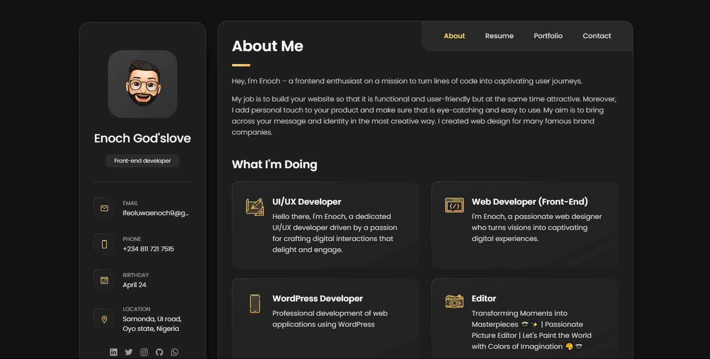
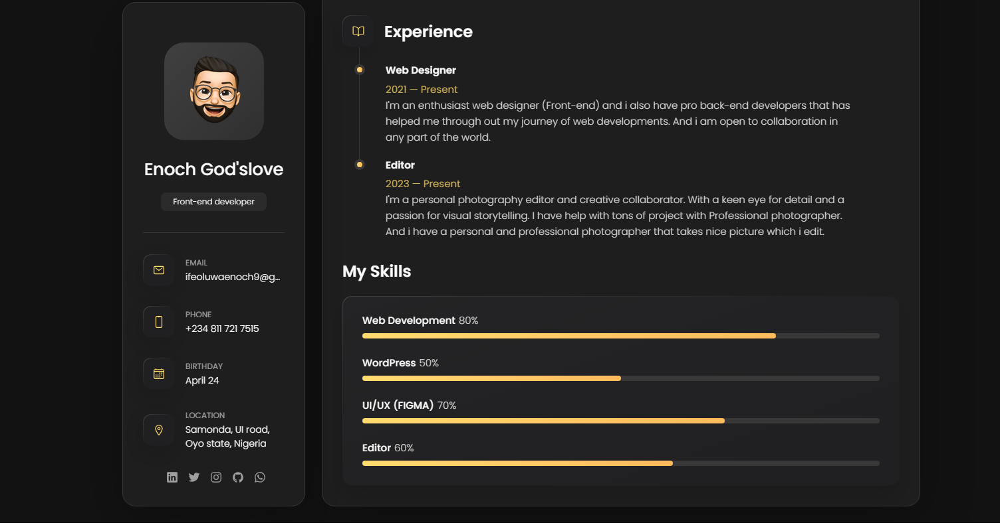
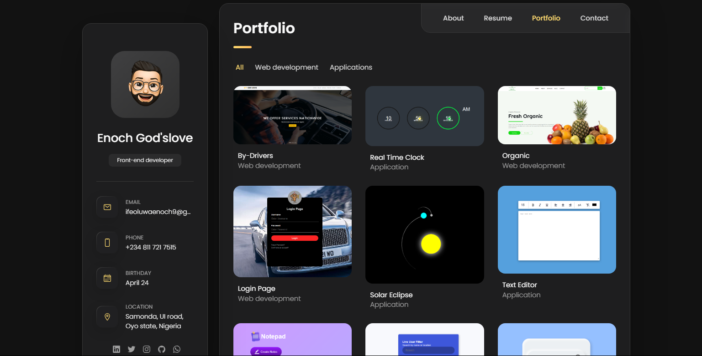
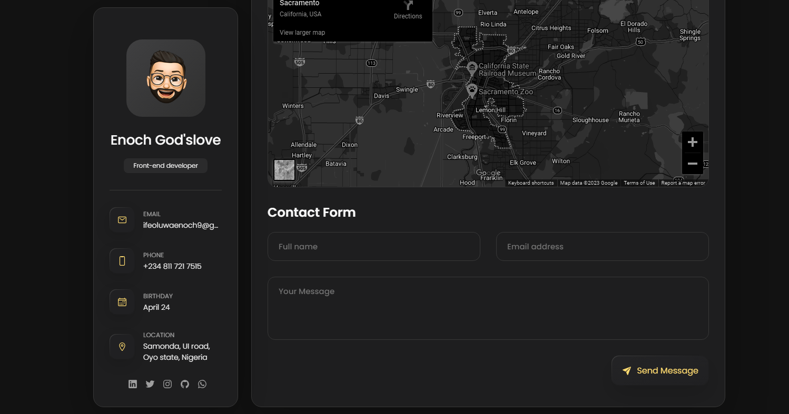

# MY-Portfolio
This is my portfolio website and i will be showing the screenshot of how it looks like

<h1>Screenshots and discription</h1>
 
<h4>Screenshot 1</h4>

<h4>Screenshot 2</h4>

<h4>Screenshot 3</h4>

<h4>Screenshot 4</h4>

<pre>Don't forget to give reviews</pre>

